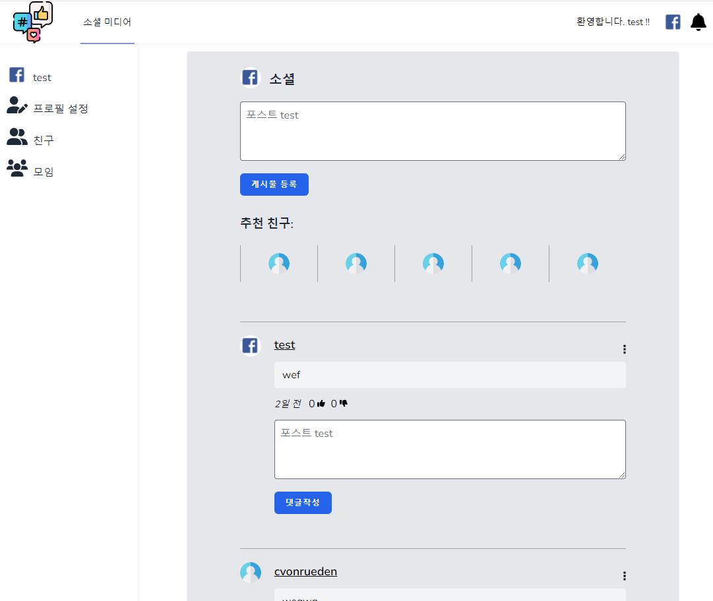
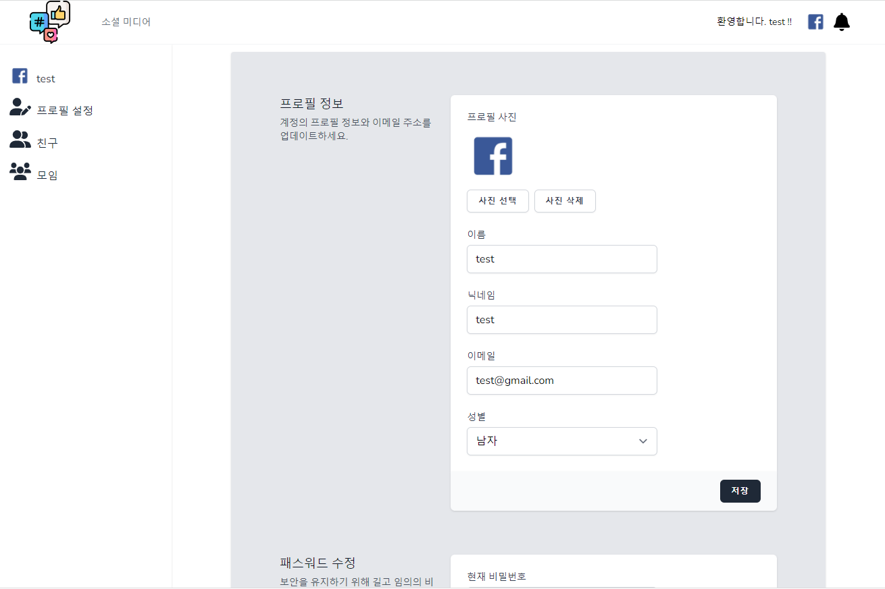
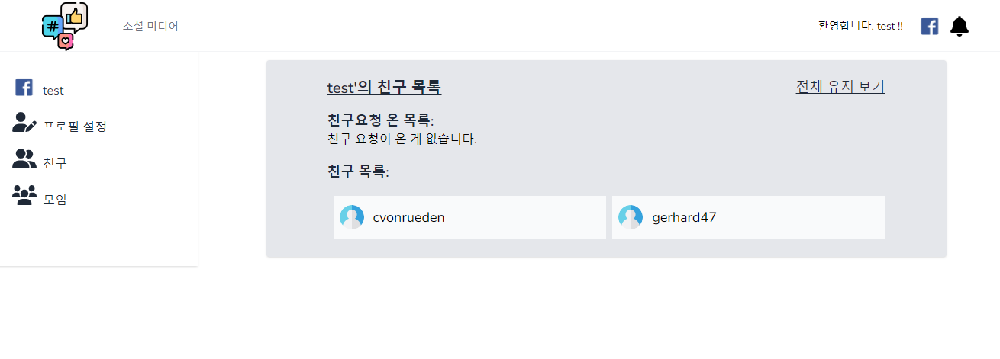
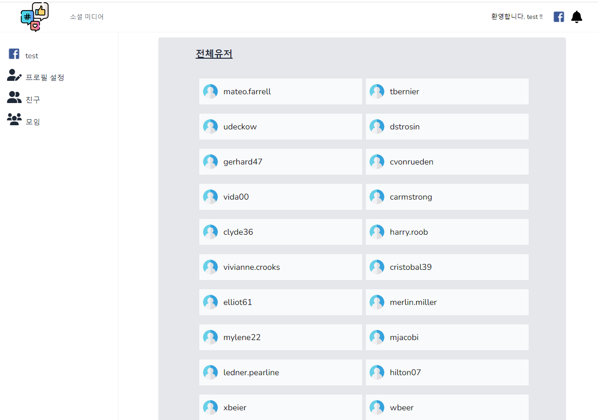

## php Laravel 소셜 네트워크

-Inertiajs 
-vue.js 
-php 
-tailwind.css 
-html 
-mysql 

## 구현 기능
-jetstream(로그인,로그아웃)
-scrollbar내릴시 데이터 전송(게시글,전체유저)(Listeners)
-게시글작성
-댓글작성
-좋아요기능
-친구 추가(Trait)
-게시글 작성시 메일알림,페이지내 알림(Notifications)

# php_Inertiajs_-
